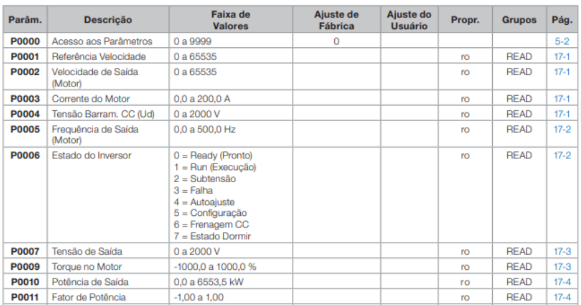

## Aula 10 - Desafio

- Utilize um dicionário para armazenar os parâmetros de um inversor de frequência.

- A estrutura do dicionário deverá ser:

<ul type=square>
    <li> Chave principal: número do parâmetro
    <li> Valor principal: outro dicionário contendo as informações
</ul>

- Após criar o dicionário, crie um cóodigo para imprimir todos os parâmetros armazenados utilizando loops.

